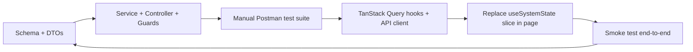

## 1. Frontend Analysis Summary

All domain types live in [Frontend/src/types/index.ts](Frontend/src/types/index.ts). State logic is centralized in [Frontend/src/hooks/useSystemState.ts](Frontend/src/hooks/useSystemState.ts). RBAC lives in [Frontend/src/auth/permissions.ts](Frontend/src/auth/permissions.ts). Pages: `Dashboard`, `Hardware`, `Tools`, `Accounts`, `Subscriptions`, `Projects`, `Employees`, `Vault`, `Guide`, `Login`.

Domains detected and their CRUD/custom ops:

- **Auth / Users** — roles: `admin | pmo | dev`; each permission maps to a Nest guard check (~40 granular permissions).
- **Employees** — CRUD + `offboard` cascade (unassign hardware → unassign tools → pull from subscription.assignedToIds → remove from project.members + clear `projectManager`, set `status=Inactive` + `offboardedAt` + `offboardNotes`). See [useSystemState.ts lines 99-130](Frontend/src/hooks/useSystemState.ts).
- **Hardware** — CRUD + assign/unassign + embedded `credentials` (device password).
- **Accounts** — CRUD + embedded `credentials` including `twoFactor` (Authenticator/SMS/Email with `secret`, `backupCodes`, `phoneNumber`, `recoveryEmail`) + `customFields`. Account deletion must null `linkedAccountId` on tools. Regenerate backup codes endpoint.
- **Tools** — CRUD + `linkedAccountId` reference + assign/unassign + `expiryDate` status computation (`Active`/`Expired`).
- **Subscriptions** — CRUD + `assignmentScope` (Individual/Team/Company-Wide) + `assignedToIds[]` + `renewalDate` + status auto-derivation (`Active`/`Expiring Soon` ≤30d /`Expired`/`Cancelled`) + `alertDays[]`.
- **Projects** — CRUD + `members[{employeeId, role}]` + linked refs (`linkedAccountIds`, `hardwareIds`, `subscriptionIds`) + embedded `standaloneCredentials[]`.
- **Vault** — read-only aggregator. Pulls credential fragments from Accounts + Hardware + Tools + Subscriptions + Projects.standaloneCredentials. RBAC-gated reveal.
- **Dashboard** — aggregates: counts, `expiringTools`, `expiringSubscriptions`, `accountsWithout2FA`, monthly spend, `activities[]` feed.
- **ActivityLog** — auto-appended on every mutation with `{module, type, description, userId, userName, timestamp}`.

## 2. Backend Architecture

```
Backend/
├── src/
│   ├── main.ts
│   ├── app.module.ts
│   ├── common/
│   │   ├── crypto/                  (AES-256-GCM encrypt/decrypt service)
│   │   ├── decorators/              (@CurrentUser, @Permissions)
│   │   ├── guards/                  (JwtAuthGuard, PermissionsGuard)
│   │   ├── interceptors/            (ActivityLogInterceptor)
│   │   ├── filters/                 (HttpExceptionFilter)
│   │   └── pipes/                   (ZodValidationPipe or class-validator)
│   ├── config/                      (env, mongo, jwt, crypto config)
│   ├── modules/
│   │   ├── auth/
│   │   ├── users/
│   │   ├── employees/
│   │   ├── hardware/
│   │   ├── accounts/
│   │   ├── tools/
│   │   ├── subscriptions/
│   │   ├── projects/
│   │   ├── vault/                   (read-only aggregator)
│   │   ├── activity-log/
│   │   └── dashboard/               (read-only aggregator)
│   └── seed/                        (seed admin/pmo/dev + mock data)
├── test/
├── .env.example
├── package.json
├── tsconfig.json
└── nest-cli.json
```

### Tech choices
- `@nestjs/core`, `@nestjs/common`, `@nestjs/platform-express`, `@nestjs/mongoose`, `mongoose`
- `@nestjs/jwt`, `@nestjs/passport`, `passport-jwt`, `bcrypt`
- `class-validator`, `class-transformer`
- `@nestjs/config`, `@nestjs/throttler`, `helmet`, `compression`, `cors`
- `@nestjs/swagger` (auto-generates docs for Postman import)
- Node `crypto` for AES-256-GCM (no extra dep)

### Security
- AES-256-GCM helper in `common/crypto/crypto.service.ts`. Master key from `CRYPTO_MASTER_KEY` (32-byte, base64). Every secret field (passwords, TOTP secret, backup codes, customFields values, standalone cred password) stored as `{iv, tag, ciphertext}` subdocument. Decrypted only in `VaultService.revealSecret()` after permission check and in controllers that the user has `vault.reveal_passwords` for.
- JWT: `access` (15 min) + `refresh` (7 days, httpOnly cookie or body). `Authorization: Bearer <access>`. Refresh endpoint rotates tokens.
- `PermissionsGuard` reads `@Permissions('hardware.create')` metadata and checks against the `rolePermissions` map (copied from frontend).

### Activity log auto-capture
- `ActivityLogInterceptor` binds to controllers via `@LogActivity({module:'Hardware', type:'creation', describe: r => ``Added hardware: ${r.name}``})`. Pushes to `activities` collection after successful response.

## 3. MongoDB Schemas (one collection per domain)

- `users` — `{email, passwordHash, name, role, avatar, refreshTokenHash, isActive, createdAt}`
- `employees` — mirrors `Employee` + `assignedAssetCount`/`assignedToolCount` computed on read via aggregation
- `hardware` — mirrors `HardwareAsset`; `credentials` is encrypted sub-doc; `assignedToId` is ObjectId ref
- `accounts` — mirrors `Account`; `credentials.password`, `credentials.twoFactor.secret`, `credentials.twoFactor.backupCodes[]`, `credentials.customFields[].value` all encrypted
- `tools` — `linkedAccountId` + `assignedToId` ObjectId refs; encrypted partial creds
- `subscriptions` — `assignedToIds: ObjectId[]`, encrypted creds, indexed on `renewalDate`
- `projects` — `members[]`, linked id arrays, embedded `standaloneCredentials[]` (password encrypted)
- `activities` — append-only, indexed on `timestamp` + `module`

All schemas get `timestamps: true`, `toJSON.transform` that strips `__v` / `passwordHash` / raw encrypted payloads and returns decrypted "masked" values.

## 4. Delivery Workflow (module by module)

For each module we ship this loop:



TanStack Query integration (added to Frontend):
- `Frontend/src/api/client.ts` — axios instance with JWT interceptor + refresh-on-401
- `Frontend/src/api/queries/` — one file per module (`useHardware`, `useAddHardware`, etc.)
- Invalidation keys: `['hardware']`, `['employees']`, `['activities']`, etc.
- Replace `useSystemState` incrementally — first employees, then hardware, etc.

## 5. Build Order (recommended sequence)

Module order is chosen so dependencies land first:

1. **Bootstrap** — Nest scaffold, Mongo connection, config, crypto service, global guards/filters, health endpoint
2. **Auth + Users** — seed admin/pmo/dev, `POST /auth/login`, `POST /auth/refresh`, `POST /auth/logout`, `GET /auth/me`, admin-only `POST /users`, `PATCH /users/:id`, `GET /users`
3. **Employees** — full CRUD + `POST /employees/:id/offboard` (cascades)
4. **Accounts** — full CRUD + `POST /accounts/:id/regenerate-backup-codes`
5. **Hardware** — full CRUD + `PATCH /hardware/:id/assign`
6. **Tools** — full CRUD + `PATCH /tools/:id/assign`, depends on Accounts/Employees
7. **Subscriptions** — full CRUD + scheduled cron that recomputes status from `renewalDate` + `alertDays`
8. **Projects** — full CRUD + `PATCH /projects/:id/members`, `POST /projects/:id/credentials`
9. **Activity Log** — wire interceptor across all modules, `GET /activities?module=&limit=`
10. **Vault** — `GET /vault` aggregated, `POST /vault/:kind/:id/reveal` permission-gated decrypt
11. **Dashboard** — `GET /dashboard/stats`, `GET /dashboard/alerts`

## 6. Testing Strategy

- Per-module Postman collection committed at `Backend/postman/AssetSphere.postman_collection.json` with environment file containing `{baseUrl, accessToken, refreshToken}` and a pre-request script that auto-refreshes.
- Each module has happy-path + permission-denied + validation-error requests.
- Only after Postman green do we wire the frontend TanStack Query layer for that module.

## 7. Environment Variables (`.env.example`)

```
PORT=4000
MONGO_URI=mongodb://localhost:27017/assetsphere
JWT_ACCESS_SECRET=<random>
JWT_REFRESH_SECRET=<random>
JWT_ACCESS_TTL=15m
JWT_REFRESH_TTL=7d
CRYPTO_MASTER_KEY=<base64 32 bytes>
CORS_ORIGIN=http://localhost:5173
SEED_ADMIN_EMAIL=admin@assetsphere.com
SEED_ADMIN_PASSWORD=admin123
```

## 8. Open conventions
- REST, kebab-case URLs, plural nouns (`/api/v1/hardware`, `/api/v1/employees/:id/offboard`)
- Global prefix `/api/v1`
- Request validation via `class-validator` DTOs
- All write endpoints return the mutated entity (with decrypted non-secret fields)
- All responses wrapped `{ data, meta? }`; errors as `{ statusCode, message, errors? }`